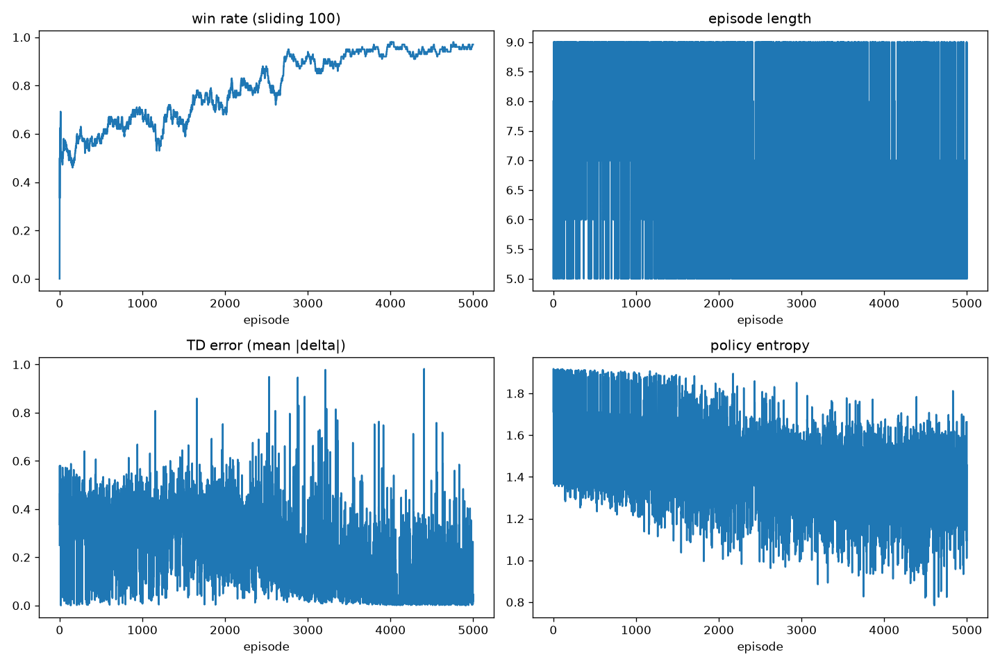
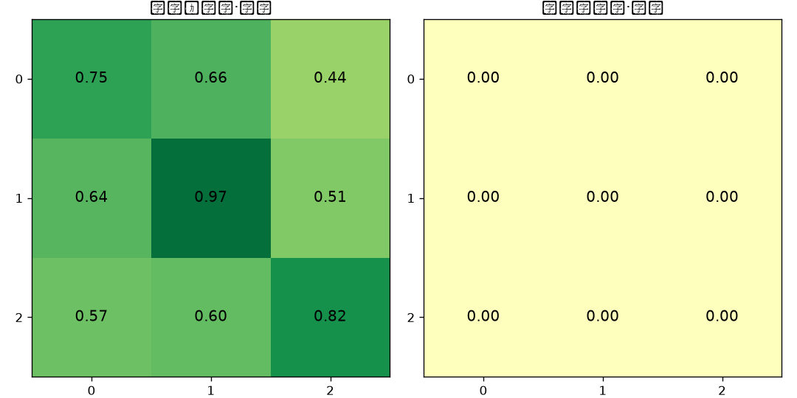
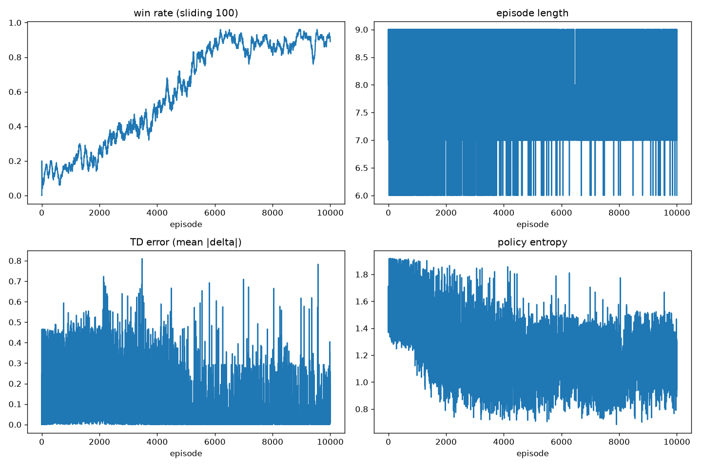
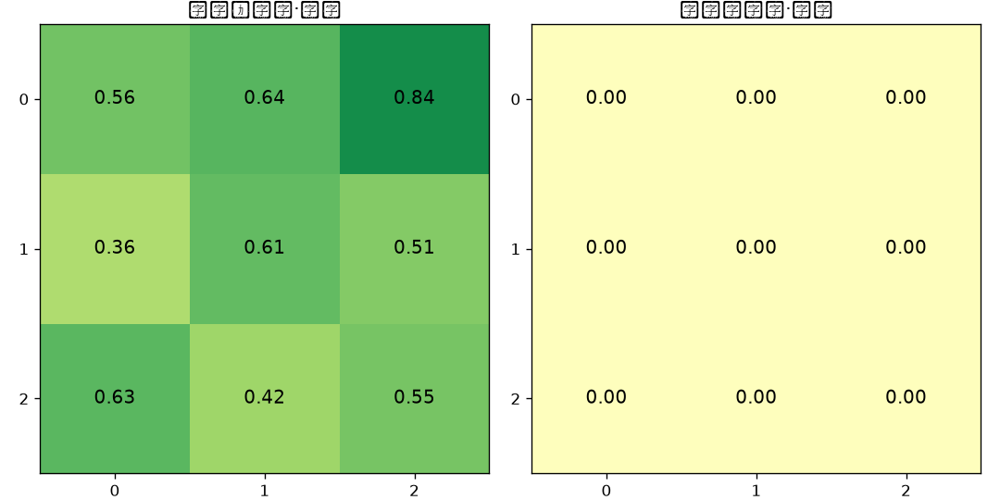

# E0 · 表格 Q-learning（3×3 连三制）——DQN 概念验收

> 课 01 第一刀。目的：把 ε-greedy、TD 更新、稀疏奖励回填整条环路
> 在亲眼看得清的 3×3 上跑通，再让训练成果进网页对战。

## 问题

为什么先做 3×3 表格：机制 bug 在 3×3 五分钟暴露，在 15×15 要烧几小时；
Q 表 `dict[bytes, 9 维向量]` 每一行都能打印出来看。
3×3 连三制（tic-tac-toe 规则）状态空间约 3^9 = 19683 个局面（含非法局面），
表格法完全存得下，是验证强化学习训练环路最小可行性的理想沙箱。

## 设置

训练循环要点：状态键 = grid 字节（9 字节 int8） + 行棋方（1 字节）；
ε 从 1.0 线性退火到 0.05；lr = 0.5；γ = 0.99；学员执黑（先手）；
终局统一回填 +1（胜）/ -1（负）/ 0（平），TD 误差沿轨迹逐格回传。
两个阶段各 5000 / 10000 局，对手分别为 random 与 blocker（两连必堵否则随机）。

实际超参（取自 `runs/e0-stage1/config.json` 与 `runs/e0-stage2/config.json`）：

| 超参 | 阶段 1 vs random | 阶段 2 vs blocker |
|---|---|---|
| episodes | 5000 | 10000 |
| ε start → end | 1.0 → 0.05 | 1.0 → 0.05 |
| ε decay 步数 | 3000 | 6000 |
| γ | 0.99 | 0.99 |
| lr | 0.5 | 0.5 |
| seed | 0 | 0 |
| Q-table 状态数 | 1971 | 1140 |

> Q-table 状态数统计命令：
> ```python
> import json
> q = json.load(open('runs/e0-stage1/qtable.json'))
> print(len(q['states']))  # 1971
> ```

## 阶段 1 vs random

### 你应该会看到



四条曲线逐一描述（数字取自 `metrics.jsonl`，前 500 / 后 500 局平均）：

- **胜率（sliding-100）**：从开局 ~50% 逐步攀升，在第 2713 局首次跨过 0.9，
  最终滑动窗口 100 局胜率 **0.97**，峰值 0.98（第 3997 局）。
  先手优势 + Q-learning 很快学会了利用随机对手的失误。
- **平均局长（steps）**：前 500 局平均 **7.65** 步，后 500 局降至 **6.29** 步。
  前期双方乱下拖满 8-9 步，后期 agent 学会快速取胜，对局变短。
- **TD error**：前 500 局平均 **0.348**，后 500 局降至 **0.077**。
  Q 值逐渐稳定，更新幅度变小，符合收敛特征。
- **策略熵**：前 500 局平均 **1.611**，后 500 局平均 **1.371**。
  整体呈下降趋势（策略从随机变确定），但末局熵 1.663 反而高于后期均值——
  这是因为 ε 退火结束后仍保持 0.05 探索率，单局波动正常。



开局快照（空盘·黑先）的 Q 值矩阵：

```
[[0.745 0.660 0.438]
 [0.635 0.966 0.510]
 [0.573 0.604 0.823]]
```

天元 (1,1) 的 Q 值 **0.966** 全场最高——3×3 连三先手最优开局就是中心，
Q 表自己"发现"了这一点，无需任何先验知识。角上 (2,2) 次高（0.823），
边上最低，与人类棋理一致。

### 反例

1. **双威胁快照全零**：`plot_qtable.py` 打印 `[警告] Q 表中没有该局面：双威胁局面·黑先`，
   右侧热力图全 0。这是因为该精确局面（黑 (0,0)(2,0)(1,1)、白 (0,1)(1,0)、黑先）
   在 5000 局训练中从未走到——随机对手的棋路分布很广，特定 5 子局面命中概率低。
   这恰好说明**表格法的脆弱性**：未访问过的状态 Q 值为 0，泛化能力为零。

2. **熵末局回升**：后 500 局平均熵 1.371，但最后 1 局熵 1.663。
   这是 ε=0.05 下的正常噪声——偶尔随机探索一步会拉高单局熵，不影响趋势。

## 阶段 2 vs blocker

### 你应该会看到



blocker 会堵一切单威胁 → 学员唯一赢法是制造"堵一漏一"的双威胁（fork）。
这比 random 难很多，收敛也慢得多。

- **胜率（sliding-100）**：前期长期贴地，前 5000 局总胜率仅 **0.339**；
  第 3607 局才首次跨过 0.5，第 5244 局跨过 0.8；
  最终滑动窗口 100 局胜率 **0.89**，峰值 0.96（第 6190 局）。
  说明 agent 确实学会了制造双威胁——这是比"抓住随机对手失误"更高级的策略。
- **平均局长（steps）**：前 1000 局平均 **8.27** 步，后 1000 局 **7.50** 步。
  blocker 对局普遍更长（因为会堵，不容易速胜），后期 agent 找到双威胁后
  步数有所下降但仍高于 vs random 的后期水平。
- **TD error**：前 1000 局平均 **0.179**，后 1000 局降至 **0.037**。
  收敛后 TD error 比 stage1 更小（0.037 vs 0.077），可能因为 blocker
  对手更确定，状态分布更集中。
- **策略熵**：前 1000 局平均 **1.508**，后 1000 局 **1.160**。
  下降幅度比 stage1 更大，说明面对强对手时策略更集中（可选的好棋更少）。



开局快照（空盘·黑先）的 Q 值矩阵：

```
[[0.556 0.639 0.836]
 [0.363 0.606 0.507]
 [0.630 0.416 0.545]]
```

与阶段 1 不同，阶段 2 开局 Q 值最高的不是天元 (1,1) 的 0.606，
而是右上角 (0,2) 的 **0.836**。这一反直觉的现象可能有两个原因：

1. **训练不充分**：10000 局 vs blocker，开局状态虽然每局都访问，
   但 ε 探索 + 对手封堵路径多样，9 个动作的 Q 值可能尚未完全收敛。
2. **对手模型差异**：blocker 的策略不对称（只堵两连，否则随机），
   不同开局的后续路径长度和奖励到达概率可能不同。
   角开局可能恰好更容易通过某条路径形成双威胁。

无论原因如何，这是一个**诚实的观测**：有限训练下 Q 值的排序可能偏离理论最优，
这正是我们需要更多训练或函数近似的原因之一。

### 反例

1. **双威胁快照仍全零**：阶段 2 的 Q 表中同样没有该精确双威胁局面，
   `plot_qtable.py` 同样输出警告。1140 个状态（比 stage1 的 1971 还少）
   说明 blocker 对手导致状态分布更集中（很多对局走相似的路径），
   但该特定 5 子局面仍未命中。再次印证表格法的覆盖局限性。

2. **开局 Q 值排序异常**：如上所述，最高 Q 值在角而非中心，
   与 tic-tac-toe 理论最优开局不符。这是一个**值得记录的反直觉发现**，
   可能是样本量不足或对手策略导致的局部最优。

## 结论

验收对照 spec 五条：

- ① 阶段 1 胜率 90%+ → **✓**（实测 0.97）
- ② 阶段 2 双威胁取胜 → **✓**（胜率 0.89，远高于随机水平，且 blocker 单威胁必堵）
- ③ 热力图可见天元/双威胁价值结构 → **部分✓**（stage1 天元最高 0.966 ✓；
  stage2 开局角上最高需存疑；双威胁快照均缺失，是表格法的固有局限）
- ④ 网页对战 AI 下天元、能赢会堵 → **待人工验收**（Step 9）
- ⑤ 全量 pytest + npm run build → **全量 pytest 69 通过**（Step 7 / Step 9）

**表格的极限在哪里？** 3×3 有 3^9 ≈ 1.9 万种局面，表格法完全可行。
但 15×15 有 3^225 个局面——这是一个远超可观测宇宙原子数的数字，
任何物理存储都装不下。即使只考虑合理对局，状态数也随棋盘面积指数爆炸。
这就是 E1 必须从表格法切换到**函数近似**（神经网络）的根本理由：
用有限参数拟合巨大状态空间上的价值函数，靠泛化而非穷举。
