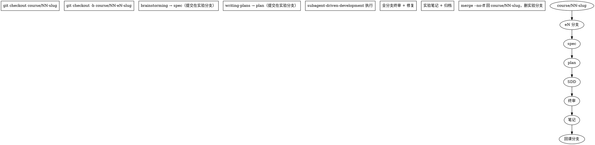

# 课程分支与交付 SOP

> 本仓库以"课程"为交付物。分支结构 = 课程结构：一个实验分支是课的一节，
> 一个课分支是一门课，main 是已发布课程的演进主线。
> 配套文档：README 路线图（M0-M6）、`docs/course/01-dqn-outline.md`（课01 实验清单）。

## 1. 分层模型

| 层 | 分支命名 | 生命周期 | 合并去向 |
|----|----------|----------|----------|
| 发布主干 | `main` | 永续，永远绿色（全量测试+构建通过） | — |
| 课分支 | `course/NN-slug`，如 `course/01-dqn` | 一门课：开课 → 结课 | **结课验收通过后**整课合入 main，打 tag |
| 实验分支 | `course/NN-eN-slug`，如 `course/01-e0-tabular-q` | 一个实验 = 一次完整 brainstorm→spec→plan→SDD 流水线 | SDD 终审通过后合回**课分支** |
| 基建分支 | `feature/mN-slug`，如 `feature/m0-platform` | 平台能力（跨课共享的环境/对弈平台/训练基建） | 直接合入 main |

> 命名说明：git 分支名不能嵌套（有 `course/01-dqn` 就不能有
> `course/01-dqn/e0`），故实验分支用 `course/NN-eN-slug` 平铺命名，
> 与课分支共享 `NN-` 前缀，`git branch --list "course/01-*"` 即可列出该课全部线。

要点：

- **实验不直接进 main**。井字棋（E0）只是课 01 的一节，它合入课分支；
  课 01 的 E0-E11 全部完成并通过结课验收，课程才作为整体交付到 main。
- 课分支期间 main 不动（除非有紧急修复）；课程交付时是**一次 squash-free
  的 merge --no-ff**，保留全部实验历史——课程的价值在过程，不压缩。
- 基建里程碑（M0 环境/平台、M1 对弈功能）服务所有课程，走 `feature/`
  直达 main（M0/M1 已按此完成）。

## 2. 各层的验收门

**实验分支 → 课分支：**
1. SDD 全部任务完成 + 每任务双审（spec + 质量）+ 全分支终审通过
2. 实验笔记落库：`docs/course/NN-slug/eN-slug.md`，五段式
   （问题→设置→你应该会看到→反例→结论），曲线/热力图归档同目录 `assets/`
3. 全量 `pytest` + `npm run build` 绿
4. 训练产物 `runs/` 不入库；网页可验收的实验需人工过一遍验收标准

**课分支 → main（结课交付）：**
1. 课的实验清单全部完成（如课 01 的 E0-E11）
2. 结课考试完成：基准赛成绩 + 实验总图 + 逐图笔记（见课01大纲）
3. README 路线图对应项勾选，课内文档互链完整
4. 合入 main + 打 tag `course/NN`（如 `course/01`）

## 3. 一个实验的流水线（与 superpowers 对接）

- spec/plan/实验笔记都随实验分支走，合并时自然入课分支。
- 一个"大实验"可拆多刀（如课 01 主体先 E0 概念验收、再 15×15 基础设施），
  每刀一个独立实验分支，分支名用 `eN-slug` 或 `eN-cutK-slug` 区分。

## 4. 当前对照

- M0/M1：基建分支 → main ✓（历史合流，符合本 SOP 的基建路线）
- 课 01：第一刀实验分支 `course/01-e0-tabular-q`（自 main 拉出）执行中；
  E0 合并时创建课分支 `course/01-dqn`，此后各刀从课分支拉出
