# 课程分支与交付 SOP

> 本仓库以"课程"为交付物。分支结构 = 课程结构：一个实验分支是课的一节，
> 实验分支逐个 merge --no-ff 叠加进 main，课的边界由 tag 圈出（start=洁净空间，
> 结课=成品）。
> 每个实验内部分**学习环**（用户拍板设计决策、亲自解读结果，老师指导）
> 与**工程环**（无学习争议的机制实现，SDD 自动执行）——见第 3 节。
> 配套文档：README 路线图（M0-M6）、`docs/course/01-dqn-outline.md`（课01 实验清单）。

## 1. 分层模型：实验分支直接叠加 main，课由 tag 圈出

| 层 | 命名 | 生命周期 | 合并去向 |
|----|------|----------|----------|
| 发布主干 | `main` | 永续，永远绿色（全量测试+构建通过） | — |
| 实验分支 | `course/NN/eN-slug`，如 `course/01/e0-tabular-q` | 一个实验 = 一次完整 学习环+工程环 流水线 | 完成验收后 **merge --no-ff 进 main**，删实验分支 |
| 基建分支 | `feature/mN-slug`，如 `feature/m0-platform` | 平台能力（跨课共享的环境/对弈平台/训练基建） | 直接合入 main |

| tag | 指向 | 何时打 |
|-----|------|--------|
| `course/NN-start` | **课的洁净空间**：该课动工前的 main 快照 | 该课第一个实验分支拉出之前 |
| `course/NN` | **课的成品**：该课结课时的 main | 实验清单全部完成 + 结课考试通过 |

要点：

- **没有课分支**。课 = 一串实验分支在 main 上依次叠加的区间，由两个 tag 圈出。
  课分支层移除后分支命名可嵌套，`git branch --list "course/01/*"` 即列出该课全部实验线。
- **实验是叠加的最小粒度**。每实验一个 `--no-ff` merge commit——既是 main 永远绿的
  验收点，也天然成为"实验完成时刻"的时间标记，教程可直接引用
  （"学到 E2 为止的代码长什么样"，checkout 那个 merge commit 即可）。
- **洁净空间服务跟随者**。学习者 clone 后 `git checkout course/01-start`
  得到该课开始前的代码，跟着教程亲手重建每个实验；`course/01` 看成品。
  README 课程线为每门课标注这两个锚点。
- 基建里程碑（M0 环境/平台、M1 对弈功能）服务所有课程，走 `feature/`
  直达 main（M0/M1 已按此完成）。

## 2. 各层的验收门

**实验分支 → main（每次实验交付）：**
1. SDD 全部任务完成 + 每任务双审（spec + 质量）+ 全分支终审通过
2. 实验笔记落库：`docs/course/NN-slug/eN-slug.md`，五段式
   （问题→设置→你应该会看到→反例→结论），曲线/热力图归档同目录 `assets/`
3. 全量 `pytest` + `npm run build` 绿
4. 训练产物 `runs/` 不入库；网页可验收的实验需人工过一遍验收标准
5. **学习环闭环**：spec 中所有 `[决策·用户]` 条目均能指回一次 D1 讨论；
   笔记"你应该会看到"含 D2 预测 vs 实测对照；"结论"体现用户亲历的
   解读与假设过程，不是纯观测罗列

**结课（课的最后一层叠加，无单独合并动作）：**
1. 课的实验清单全部完成（如课 01 的 E0-E11）
2. 结课考试完成：基准赛成绩 + 实验总图 + 逐图笔记（见课01大纲）
3. README 路线图对应项勾选、课程线锚点 tag 标注完整，课内文档互链完整
4. 打 tag `course/NN`（如 `course/01`）

## 3. 一个实验的流水线：学习环 + 工程环

> 本仓库交付物表面是课程，本质是**学习过程**。SDD 能把工程做对，但若把设计决策
> （奖励怎么设、超参怎么调、对手怎么配）也一并自动完成，等于替学习者删掉了
> "试错→观察→修正"的回路。E0 第一刀的教训：上来把一切搞定，事后看曲线再被动
> 问答——知识讲过了，但没有长在学习者手里。故流水线拆成两环。

### 3.1 学习环（用户主导，老师指导）——学习性决策与结果解读

四个固定讨论节点，位于 spec 前后与训练前后：

| 节点 | 时机 | 做什么 | 铁律 |
|------|------|--------|------|
| **D1 设计决策** | spec 之前 | 奖励设置、超参、对手配置、探索策略、网络结构等学习性取舍 | 老师列选项 + 权衡，**用户拍板**；不拍板不进 spec |
| **D2 预测** | 训练之前 | 写"你应该会看到"：预期曲线形状、收敛阈值、热力图结构 | 用户先猜，老师补充修正；预测写进 spec 验收标准，跑完对照 |
| **D3 解读** | 训练之后 | 读曲线/热力图/指标，解释现象 | **用户先解读**，老师反问、纠偏、补讲；一次只讲一步，不倾倒 |
| **D4 反直觉** | 任何时候出现预期外现象 | 假设 → 最小验证 → 结论 | 老师引导用户走完假设链，不代下结论也不放过 |

**老师守则**：

- 一步一步讲，等用户跟上再继续（E0 中"刷的一下全给出来"是明确反例）；
- 先反问后讲解：用刚跑出的真实数字提问，让用户先想，再给答案；
- 概念挂在数据上讲（如 lr 配 30 次采样演示），不悬空说教；
- 学习性决策永远留给用户，老师只提供选项、权衡与建议。

**决策点标注制度**：spec 中每条设计决策标注 `[决策·用户]`（有讨论记录）
或 `[机制·自动]`（工程判断，SDD 直接执行）。标注即问责：合并验收时核对
`[决策·用户]` 条目都能指回一次 D1 讨论。

### 3.2 工程环（SDD 自动化）——无学习争议的机制实现

环境改造、玩家接入、绘图脚本、前端适配这类**换一种做法也不影响"学到什么"**
的机制工作，照旧走 brainstorm→spec→plan→SDD 全自动，不做无谓的打断讨论。
判断标准一句话：这条决策错了，学习者会学到东西吗？不会 → 工程环。

### 3.3 完整流水线

```dot
digraph experiment {
  rankdir=TB;
  "git checkout course/NN-slug" [shape=box];
  "git checkout -b course/NN-eN-slug" [shape=box];
  "D1 设计决策讨论（用户拍板）" [shape=box];
  "spec（[决策·用户]/[机制·自动] 标注 + D2 预测值）" [shape=box];
  "plan → SDD 工程环执行" [shape=box];
  "训练运行" [shape=box];
  "D2 对照：预测 vs 实测" [shape=box];
  "D3 用户先解读曲线，老师补讲" [shape=box];
  "D4 反直觉现象处理（如有）" [shape=box];
  "实验笔记 + 归档" [shape=box];
  "全分支终审 + merge --no-ff 进 main，删实验分支" [shape=box];
}
```

- 首个实验合并前（即课动工前）在 main 打 `course/NN-start`；结课时打 `course/NN`。
- spec/plan/实验笔记都随实验分支走，合并时自然入 main。
- 一个"大实验"可拆多刀（如课 01 主体先 E0 概念验收、再 15×15 基础设施），
  每刀一个独立实验分支，分支名用 `eN-slug` 或 `eN-cutK-slug` 区分。

## 4. 当前对照

- M0/M1：基建分支 → main ✓（历史合流，符合本 SOP 的基建路线）
- 课 01：实验分支 `course/01-e0-tabular-q`（历史平铺命名）已完成，
  E0 合并 = 课 01 的第一层叠加。合并步骤：先在 main 打 `course/01-start`
  （课 01 洁净空间），再 merge --no-ff，实验分支改名嵌套式留待后续实验统一
- E0 是学习环缺失的教训样本——设计决策（对手/奖励/超参）与曲线解读均未走
  学习环，事后问答补课。E1 起严格两环：超参与奖励设计先 D1 讨论，训练前先 D2 预测
